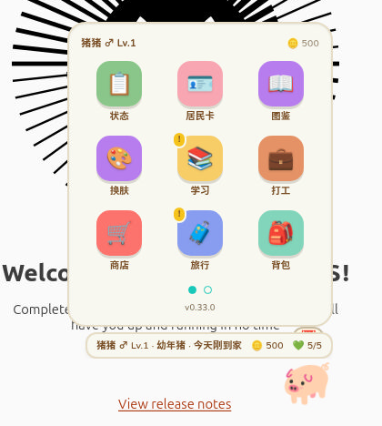
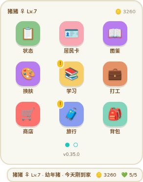
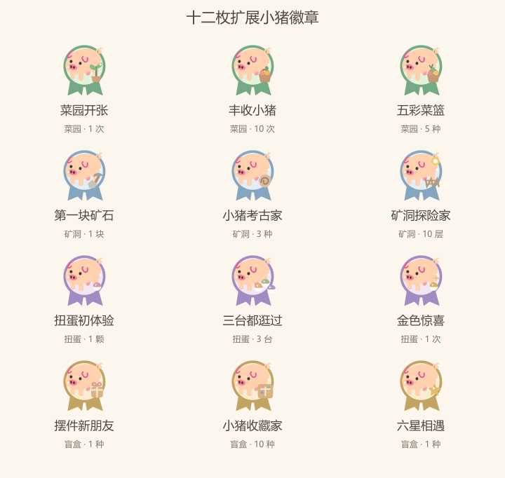
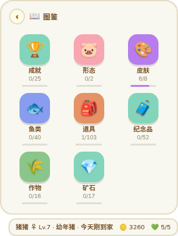
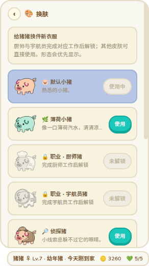

<p align="center"></p>

<h1 align="center">dsh-piggy</h1>

<p align="center">一只住在 <a href="https://github.com/deepseek-ai/deepseek-harness">DeepSeek Harness</a> 里，也能独立住在桌面上的猪。</p>

它会长大、上学、打工、旅行、钓鱼、生病，也会跟你搭话。界面采用动森风格的 App 主菜单，全部玩法都能用鼠标完成。番茄钟、钓鱼这类玩法是扩展：可以单独关掉、删除，也能从本仓库在线下载新扩展（盲盒、扭蛋、菜园、矿洞）。

**欢迎一起画猪。** 目前项目还缺形态、动作和皮肤等美术资源；如果你有喜欢的猪猪形象，欢迎提交 [Pull Request](https://github.com/CLICGGER-TYPES/dsh-piggy/pulls)，我会认真看并合并合适的作品。也欢迎 Fork 项目，做一只完全符合自己喜好的猪。自定义皮肤可从[制作教程](docs/guides/creating-skins.md)开始。

- **完整养成**：照顾、成长、学习、工作、旅行、收藏和晋升形态
- **扩展**：在「设置 → 🧩 扩展」里开关、删除、在线下载和更新，数据保留；扩展默认都开着
- **盲盒**（在线扩展）：照明日方舟寻访的规矩——3★～6★ 摆件、常驻和限时卡池轮换 UP、50 抽后六星概率逐抽提升；卡背翻成闪卡，摆件进图鉴，资质凭证在商店换东西
- **扭蛋**（在线扩展）：零食机、杂货机、药箱三台，每天第一次免费，出现有的食物、洗浴、玩具和药，幸运值满 20 必出金色
- **菜园**（在线扩展）：开垦地块、买种子、每个阶段浇一次水，按真实时间生长（离线照算），收获卖钱或放进背包
- **矿洞**（在线扩展）：10 层矿洞往下挖，越深矿越值钱，化石和宝石进图鉴；体力 100，每 3 分钟回 1 点
- **钓鱼**：咬钩后随机是圆盘、竖条拉锯、拉力收线三种玩法之一，也能让猪自己出门钓
- **桌面版**：Windows、Linux 和 macOS 可独立运行；猪和面板各一个窗口，开面板、拖到屏幕边、冒气泡，猪都稳稳待在原地
- **角色外观**：完成厨师或宇航员工作解锁职业外观，另有免费内置皮肤，也可导入自己的 SVG 皮肤包
- **Emoji 可选**：网页版和桌面版都自带整套彩色 emoji 字体，「设置 → Emoji 样式」可以在「内置」和「系统自带」之间切，机器上缺字也不会变方框
- **出问题能查**：「设置 → 日志 → 导出日志」一键导出运行日志（桌面版弹系统「另存为」），里面记着版本、动作、扩展下载和报错
- **会自己过日子**：按时间问候、提醒喝水休息、过节；点不同部位反应不同；闲着会打滚、打盹、追蝴蝶，桌面版还能出去散步（默认关）；每天写一篇带点黑色幽默的日记
- **零 token**：不注册模型工具，不向对话注入宠物状态

<p align="center">
  
  
  
</p>
<p align="center">
  
  
</p>

## 安装

### DSH 插件

```sh
dsh plugin --profile web add dsh-piggy
```

安装后重启 DSH，再刷新页面。

在按 `dsh-plugin-*` 搜索的社区目录中，也可安装 [`dsh-plugin-piggy`](https://www.npmjs.com/package/dsh-plugin-piggy)：`dsh plugin --profile web add dsh-plugin-piggy`。它加载同一个游戏，每个 profile 安装其中一个即可。

如果想直接使用 GitHub 源码，可以克隆本仓库，再执行 `dsh plugin --profile web add /path/to/dsh-piggy`。

### 桌面版

从 [GitHub Releases](https://github.com/CLICGGER-TYPES/dsh-piggy/releases/latest) 下载对应系统的文件（国内可以用 [Gitee 发行版](https://gitee.com/clicgger/dsh-piggy/releases)：Gitee 版的检查更新、游戏包和在线扩展都走 Gitee）：

- Windows：`setup.exe` 安装版或 `portable.exe` 便携版
- Linux：`AppImage`
- macOS：按芯片选择 `arm64.dmg` 或 `x64.dmg`

macOS 包暂未签名，第一次打开请在访达中右键应用并选择“打开”。更多安装与存档说明见[桌面版指南](docs/guides/desktop.md)。

「设置 → 更新」会分别显示游戏版本和桌面外壳版本（有新正式版时设置图标上有红点）。游戏包可在 App 内更新；桌面外壳从 v0.2.0 起，Windows 安装版和 Linux AppImage 可在 App 内下载并重启安装。Windows 便携版、未签名 macOS 版需到发布页手动替换；旧版外壳需先手动升级一次。详见[更新说明](docs/guides/updates.md)。

当前桌面外壳是 **v0.6.0**：猪和面板拆成了两个窗口（面板单独一个窗口贴在猪旁边，开面板、拖动时猪不再跳）。游戏 v0.33.0 起需要这个外壳——旧外壳会继续用自带的游戏包，并在「设置 → 更新」里提示先更新桌面程序（Windows 安装版和 Linux AppImage 可在 App 内更新，其余到发布页下载）。窗口摆放、可点区域、桌面样式等仍在游戏包里，这类修复在「更新」里点一下就到。

在线扩展从本仓库的 [`extensions/registry.json`](extensions/registry.json) 读，文件挂在本仓库的 GitHub Release（`ext-<名字>-<版本>`），下载后逐个核对校验值；只会安装我们自己发布的扩展。格式和写法见[扩展删除与在线下载](docs/design/extension-download.md)。

商店和背包中的「装扮」入口暂时隐藏，已有装扮和穿戴记录会保留；后续会重新设计展示方式。

## 开始玩

右键小猪打开主菜单，左键摸摸它，拖动可以换位置。第一次见到纸盒时连续点三下，把猪接回家。

详细玩法、体型、美术图标设置和命令见[玩法指南](docs/guides/gameplay.md)。换肤可直接阅读[玩家换肤教程](docs/guides/skins.md)，制作皮肤从[自定义皮肤制作教程](docs/guides/creating-skins.md)开始。

图鉴里的「成就」记录日常照顾、学习、工作、旅行、收藏与晋升；基础十六枚小猪徽章之外，菜园、矿洞、扭蛋和盲盒各有三枚扩展徽章，安装并更新对应扩展后可积累。规则及试玩方法见[成就设计](docs/design/achievements.md)和[扩展成就](docs/design/extension-achievements.md)。

## 文档

- [文档中心](docs/README.md)
- [玩法与养成规则](docs/guides/gameplay.md)
- [桌面版安装、存档与更新](docs/guides/desktop.md)
- [游戏包与桌面外壳怎样更新](docs/guides/updates.md)
- [扩展：删除与在线下载](docs/design/extension-download.md) · [盲盒](docs/design/blindbox.md)
- [日志与导出](docs/design/log-export.md)（设置 → 日志）
- [维护交接文档（接手维护先读）](docs/HANDOFF.md)
- [开发与调试](docs/DEVELOPMENT.md)
- [版本记录](CHANGELOG.md)

## 开发

```sh
npm install --no-save --package-lock=false esbuild@0.28.2 typescript@5.9.3 @types/node@20.19.43
npm run build
npm test
npm run typecheck
```

开发环境、桌面打包、HTTP 接口和目录说明见[开发指南](docs/DEVELOPMENT.md)。

## 贡献者

这个项目有一半是玩家帮忙做出来的，谢谢每一位交出代码、画作和想法的朋友（按首次贡献时间排序）：

| 贡献者 | 贡献 |
|---|---|
| [@1nuoiscute](https://github.com/1nuoiscute) | 猪猪王原型与恶魔猪形态、肥猪体型和胖胖猪动作立绘；十六项成就与小猪徽章系统（[#6](https://github.com/CLICGGER-TYPES/dsh-piggy/pull/6)）；扩展公共进度事件与十二项扩展成就（[#7](https://github.com/CLICGGER-TYPES/dsh-piggy/pull/7)） |
| [@anupamme](https://github.com/anupamme) | 报告桌面版更新依赖的安全问题（[#5](https://github.com/CLICGGER-TYPES/dsh-piggy/pull/5)） |

想加玩法、想画猪、想报 bug 都欢迎：到 [Issues](https://github.com/CLICGGER-TYPES/dsh-piggy/issues) 说一声，或直接提 [Pull Request](https://github.com/CLICGGER-TYPES/dsh-piggy/pulls)（Gitee 用户可以在 [Gitee 仓库](https://gitee.com/clicgger/dsh-piggy) 提 Issue）。合并进来的贡献会记在这张表里。

## 致谢与许可

视觉风格参考 [animal-island-ui](https://github.com/guokaigdg/animal-island-ui)，玩法数值参考资料见 [THIRD-PARTY.md](THIRD-PARTY.md)。项目采用 [MIT License](LICENSE)。
