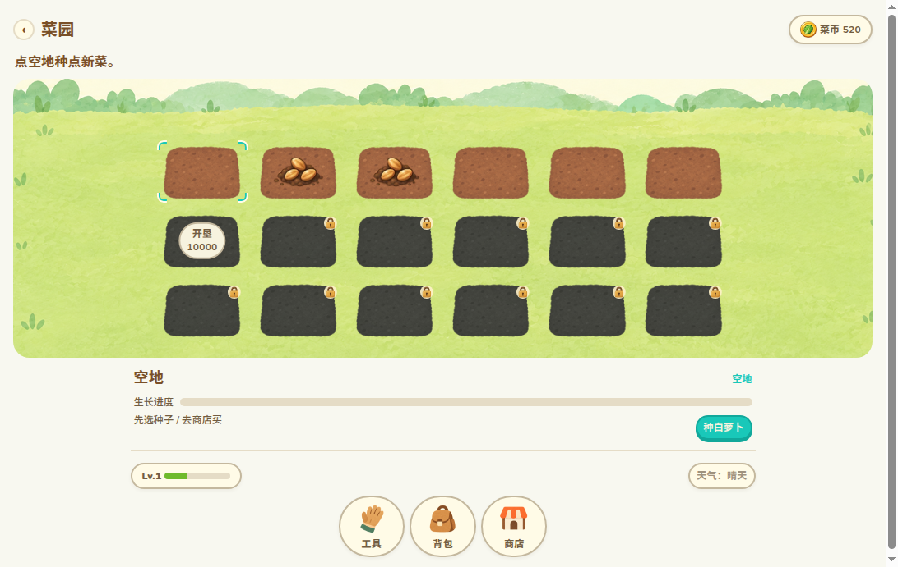
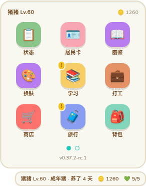
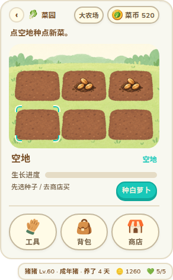

<p align="center"></p>

<h1 align="center">dsh-piggy</h1>

<p align="center">一只住在 <a href="https://github.com/deepseek-ai/deepseek-harness">DeepSeek Harness</a> 里，也能独立住在桌面上的猪。</p>

养一只会长大、上学、打工、旅行，也会跟你搭话的小猪。玩法是 QQ 宠物式的单机养成，界面是动森 NookPhone 风格；同一份代码有两种形态：住在 DeepSeek Harness 网页里的 DSH 插件，和独立的桌面版。鼠标就能完成全部玩法；忙的时候，它会用背包里的东西照顾自己。游戏不注册模型工具，也不向对话注入宠物状态，照顾小猪不消耗模型 token。

## 快速安装与稳定版下载

> **当前稳定版：游戏与 DSH 插件 0.37.1，桌面外壳 0.6.7。** 下面的安装、下载和玩法都指这个正式版；预览版单独提供，以下稳定版下载不包含 RC。

| 部分 | 稳定版 |
|---|---|
| 游戏与 DSH 插件 | 0.37.1 |
| 桌面外壳 | 0.6.7 |
| 菜园扩展 | 4.0.10；经典兼容版 3.1.0，均单独发布 |
| 矿洞扩展 | 3.0.1，单独发布 |

稳定版下载：

- [GitHub 稳定版 0.37.1](https://github.com/CLICGGER-TYPES/dsh-piggy/releases/tag/v0.37.1)
- [Gitee 稳定版 0.37.1](https://gitee.com/clicgger/dsh-piggy/releases/tag/v0.37.1)
- [夸克网盘：Windows 国内渠道](https://pan.quark.cn/s/2c571e9aaecc)

夸克网盘只提供 Windows 安装包的手动下载，不替代客户端现有的游戏包/外壳自动更新渠道。npm 由维护者手动发布；如果默认源尚未同步，以发布页上的版本为准。

预览版下载：[GitHub 0.37.2-rc.1](https://github.com/CLICGGER-TYPES/dsh-piggy/releases/tag/v0.37.2-rc.1)。Windows 安装版与便携版已在虚拟机验证；Linux/macOS 安装包构建结果与验收范围见发布页。

### DSH 插件

```sh
dsh plugin --profile web add dsh-piggy
```

安装后重启 DSH，再刷新页面。如果社区目录按 `dsh-plugin-*` 搜索，也可安装 [`dsh-plugin-piggy`](https://www.npmjs.com/package/dsh-plugin-piggy)；它加载同一个游戏，每个 profile 只需装其中一个。

使用本地源码时，克隆本仓库后运行 `dsh plugin --profile web add /path/to/dsh-piggy`。

### 桌面版

从 [GitHub 稳定版](https://github.com/CLICGGER-TYPES/dsh-piggy/releases/latest)下载对应系统的文件。国内 Windows 用户也可用 [Gitee 发行版](https://gitee.com/clicgger/dsh-piggy/releases)。Linux 和 macOS 安装包只在 GitHub 提供。

| 系统 | 下载文件 |
|---|---|
| Windows | `setup.exe` 安装版或 `portable.exe` 便携版 |
| Linux | `AppImage`，添加执行权限后运行 |
| macOS | Apple 芯片选 `arm64.dmg`，Intel 选 `x64.dmg` |

macOS 包暂未签名，第一次打开请在访达中右键应用并选择“打开”。更多说明见[桌面版安装与存档](docs/guides/desktop.md)。

## 精选界面预览

以下三张为 0.37.2-rc.1 在 Linux 测试虚拟机中的实拍，用于展示预览版界面；不能当作稳定版截图。稳定版界面仍以 0.37.1 为准。拍摄条件与校验值见[截图记录](docs/screenshots/readme-current-capture.md)。

<p align="center">
  
</p>

<p align="center">大农场：18 块地、顶部状态和下方工具区</p>

<table>
  <tr>
    <td align="center"><br>主菜单</td>
    <td align="center"><br>小农场</td>
  </tr>
</table>

大农场可以在 DSH 中展开，也能在桌面版里开独立窗口。种菜、浇水、除草、收菜，或者雇帮工猪替你照料。

## 新手上手

1. 第一次见到“猪递”纸盒时，连续点三下，把猪接回家。
2. 左键摸摸它，右键打开主菜单；桌面版拖动小猪可以换位置。
3. 从商店买食物、洗浴用品和玩具，用背包里的东西照顾它。离线照顾默认开启，可在设置里关闭。
4. 想种菜、挖矿、抽扭蛋或盲盒，去「设置 → 扩展」安装对应玩法。下载不了时，也可以从文件导入官方扩展包。

详细玩法和命令见[玩法指南](docs/guides/gameplay.md)。

## 玩法简述

| 玩法 | 内容 |
|---|---|
| 养成与生活 | 成长最高 60 级；33 种职业支持短班，15 个旅行地点可带回 52 种纪念品；12 种性格、1008 句台词；离开时自动吃东西、洗澡、玩玩具，回来有记录 |
| 菜园 | 29 种作物、18 块地，按真实时间生长，离线照算；浇水、除草、杀虫、施肥、多季收获，也能雇帮工猪。小农场与大农场共用同一份进度 |
| 矿洞 | 20 层矿洞、5 级镐，探索矿脉、宝箱、化石与电梯；可雇小矿工猪 |
| 盲盒与扭蛋 | 盲盒有 3★～6★ 摆件、卡池与保底，收藏进图鉴；三台扭蛋机每天首次免费，幸运值满 20 必出金色 |
| 钓鱼与番茄钟 | 40 种鱼、4 个钓点、4 把鱼竿，三种收线玩法；也能让猪自己出门钓鱼，或陪你专注一段时间 |
| 外观与收藏 | 免费内置皮肤、职业外观、自定义 PNG 皮肤包（兼容原 SVG 包）、五种体型药水，以及成就、纪念品和摆件图鉴。基础 16 项成就，菜园、矿洞、扭蛋和盲盒各有 3 项扩展成就 |
| 桌面陪伴 | 猪与面板分成两个窗口；小猪大小按百分比调整，可设网络代理和全屏时隐藏。猪会眨眼、打滚、打盹、追蝴蝶，散步默认关闭 |

金币按来源记账，扩展可以有自己的币，并按汇率兑换；删除扩展时余额自动换回金币。扩展可单独开关、删除、更新；在线扩展会检查最低游戏版本，只安装本项目发布并通过校验的文件，详见[扩展安装说明](docs/design/extension-download.md)。

小猪使用一套无描边平涂透明 PNG，不同状态会换成对应立绘；支持内置彩色 emoji 字体与系统字体切换。商店、背包中的“装扮”入口暂时隐藏，已有记录保留。换肤见[玩家教程](docs/guides/skins.md)，自定义皮肤从[制作教程](docs/guides/creating-skins.md)开始。

## 更新、存档与问题反馈

### 更新

游戏包和桌面外壳分开更新：「设置 → 更新」会分别显示两个版本。Windows 安装版和 Linux AppImage 支持在 App 内下载并重启安装外壳；Windows 便携版及未签名 macOS 版需到发布页手动替换。旧外壳会保留自带游戏，并提示先升级桌面程序。详见[更新说明](docs/guides/updates.md)。

### 存档

DSH 插件和桌面版目前各养一只猪，存档独立；桌面版可从 DSH 导入。稳定版「设置 → 存档」提供完整 ZIP 导出、导入预览、失败恢复与替换前自动备份，DSH 和桌面可手动迁移；只做整档替换，不合并两只猪。存档版本为 v14，旧档继续使用。备份范围、上限与验收要求见[存档传输说明](docs/design/save-transfer.md)。

### 问题反馈

遇到问题时，可到「设置 → 日志 → 导出日志」保存运行记录；桌面版会弹出“另存为”。日志包含版本、动作、扩展下载与报错，方便反馈时定位。请附上游戏/外壳/扩展版本、系统与缩放、操作步骤和日志，到 [GitHub Issues](https://github.com/CLICGGER-TYPES/dsh-piggy/issues) 或 [Gitee Issues](https://gitee.com/clicgger/dsh-piggy/issues) 反馈。

## 开发文档

- [文档中心](docs/README.md) · [玩法与养成规则](docs/guides/gameplay.md)
- [桌面版安装与存档](docs/guides/desktop.md) · [游戏包与外壳更新](docs/guides/updates.md)
- [在线扩展](docs/design/extension-download.md) · [经济体系](docs/design/economy.md)
- [第三方 agent 接入](docs/guides/agent-adapters.md) · [开发与调试](docs/DEVELOPMENT.md)
- [维护交接](docs/HANDOFF.md) · [路线图](docs/ROADMAP.md) · [版本记录](CHANGELOG.md)

```sh
npm install --no-save --package-lock=false esbuild@0.28.2 typescript@5.9.3 @types/node@20.19.43
npm run build
npm test
npm run typecheck
```

源码候选的改动和验收边界记在 [CHANGELOG](CHANGELOG.md) 的候选小节与 [ROADMAP](docs/ROADMAP.md)；候选不等于已发布功能。

<details>
<summary><strong>0.37.2-rc.1 预览版（外壳 0.6.8-rc.1）</strong></summary>

- 桌面可选整屏透明舞台：保留双窗口为默认，已完成本轮 Windows/Linux 虚拟机回归，尚未切换默认。
- 菜园 4.1.5 候选：清爽平涂纸感重排、缩小底部图文入口、选地改为四角标记；随本次 RC 提供。
- 礼包侧边与跨到期点击：讲话时待领礼包向工作区内侧摆放，按住跨过自动关闭时间仍可领取；已在 Linux 和 Windows 虚拟机场景验证。
- 桌面启动诊断与托盘恢复：补入口加载失败、重复启动、首帧前崩溃的提示和日志；托盘“恢复小猪”只恢复本机显示位置与 100% 比例，不动养成存档；该入口需要更新到配套外壳，单独更新游戏包不会增加托盘菜单。真实用户的启动问题仍需要日志定位。
- 存档：本候选将养成存档从 v14 迁移到 v15；升级前应保留完整备份，回退旧游戏时恢复对应旧档。菜园 4.1.5 / 经典 3.1.1 候选要求游戏 0.37.2（本 RC 可用）。
- 边界：Windows 500% 下自动消失的反馈尚未复现、尚未定位，恢复入口不是根因修复；macOS 未做原生验收。此版本仍为预览版，不能当成稳定版功能。

</details>

## 贡献者

这个项目有一半是玩家帮忙做出来的，谢谢每一位交出代码、画作和想法的朋友（按首次贡献时间排序）：

| 贡献者 | 贡献 |
|---|---|
| [@1nuoiscute](https://github.com/1nuoiscute) | 猪猪王原型与恶魔猪形态、肥猪体型和胖胖猪动作立绘；十六项成就与小猪徽章系统（[#6](https://github.com/CLICGGER-TYPES/dsh-piggy/pull/6)）；扩展公共进度事件与十二项扩展成就（[#7](https://github.com/CLICGGER-TYPES/dsh-piggy/pull/7)） |
| [@anupamme](https://github.com/anupamme) | 报告桌面版更新依赖的安全问题（[#5](https://github.com/CLICGGER-TYPES/dsh-piggy/pull/5)） |
| [@tetezi](https://github.com/tetezi) | 面板动作时猪窗口置顶、右键不误摸、脏和生病状态的苍蝇/病毒图标、恢复桌面版状态变色与心情优先级调整，附回归测试（[#8](https://github.com/CLICGGER-TYPES/dsh-piggy/pull/8)，随 [#9](https://github.com/CLICGGER-TYPES/dsh-piggy/pull/9) 合入） |
| [@WolalaQAQ](https://github.com/WolalaQAQ) | 运行时与 DSH 适配器拆分、工作事件接口、持久去重和事务恢复，以及后续可靠性补丁；按游戏能力控制 Windows 鼠标转发（[#19](https://github.com/CLICGGER-TYPES/dsh-piggy/pull/19)），并协助完成 Windows、DSH 和 OpenCode 独立复核（[#12](https://github.com/CLICGGER-TYPES/dsh-piggy/pull/12)、[#13](https://github.com/CLICGGER-TYPES/dsh-piggy/pull/13)） |
| [@Flappy-Boy](https://github.com/Flappy-Boy) | 反馈更新说明滚动回顶、菜园快速点击丢操作、矿洞连续挖掘站位异常，并提供复现步骤（[#16](https://github.com/CLICGGER-TYPES/dsh-piggy/issues/16)、[#17](https://github.com/CLICGGER-TYPES/dsh-piggy/issues/17)、[#18](https://github.com/CLICGGER-TYPES/dsh-piggy/issues/18)） |

欢迎画猪、报问题或贡献代码。当前立绘只有一套无描边平涂画风，原有形象与制作要求见[小猪画风](docs/art/pig-style.md)。可以先开 Issue 交流，也欢迎 Fork 项目，养一只符合自己喜好的猪。想加玩法、想画猪、想报 bug 都欢迎：到 [Issues](https://github.com/CLICGGER-TYPES/dsh-piggy/issues) 说一声，或直接提 [Pull Request](https://github.com/CLICGGER-TYPES/dsh-piggy/pulls)（Gitee 用户可以在 [Gitee 仓库](https://gitee.com/clicgger/dsh-piggy) 提 Issue）。合并进来的贡献会记在这张表里。

## 致谢与许可

**不同状态的小猪图**（`assets/pigs/feedback/`）的灵感来自 [PigHub](https://pighub.top/) 上的猪猪图片：以那里的猪猪为参考，由 AI（OpenAI 图像生成，codex 操作）重新画成本项目的样子，没有直接复制原图。谢谢 PigHub 和图片作者！如果你是原图作者，觉得侵犯了你的权利或不喜欢这样使用，请[开 issue](https://github.com/CLICGGER-TYPES/dsh-piggy/issues) 告诉我们，我们会删除相关图片。

视觉风格参考 [animal-island-ui](https://github.com/guokaigdg/animal-island-ui)，玩法数值参考资料见 [THIRD-PARTY.md](THIRD-PARTY.md)。项目采用 [MIT License](LICENSE)；小猪立绘改自 [Noto Emoji](https://github.com/googlefonts/noto-emoji) 的 🐖，按 Apache 2.0 发布（见 [THIRD-PARTY.md](THIRD-PARTY.md)）。
