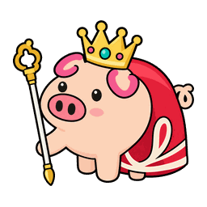

# 猪猪王：最终形态设计

状态：已合入（改编自 PR #2，作者 1nuoiscute）。猪猪王是「加冕」形态表里的第一种，
以后会有更多形态，名字仍叫加冕。存档版本 12。

## 形象

参考用户提供的“猪猪王”形象：金冠、红披风、细权杖、闭眼的从容表情。
按现有 piglet.svg / elder.svg 的朝左、蜜桃色、平涂风格重新画成可编辑路径；
透明 64×64 viewBox，不含原参考图片、文字、嵌入位图、滤镜、渐变或外部资源。
身体、披风、王冠、权杖分别保留分组，方便修改和以后适配动作。

## 素材 MVP

- pig-king.svg：睁眼待机。
- pig-king-relaxed.svg：闭眼享受，保留最初形象。
- pig-king-pet/eat/bathe/play/work/study/trip.svg：七组独立动作素材。
- tools/pig-king-preview.html：直接用浏览器打开，可看轻量 CSS 动画。

待机用睁眼版；闭眼用于享受照顾，避免所有动作都保持闭眼。
动作立绘仍为静态 SVG，游戏已按照顾反馈及工作、学习、旅行状态切换素材，并沿用动作反馈动画。

## 与最新上游兼容

上游在 2026-10-01 改为按等级成长：幼年 Lv1 → 青年 Lv10 → 成年 Lv40，取消老年阶段和寿命。
本 PR 沿用这些变化，不恢复旧年龄轴；学习课时、职业门槛、随机结算及复活/领养规则同上游。

## 加冕规则

| 条件 | 规则 |
|---|---|
| 阶段 | 存活、已孵化，进入成年阶段（Lv40 起） |
| 三维 | 智力、魅力、武力各 ≥20 |
| 工作经历 | 本代完成打工 ≥10 次；中途取消不计入 |
| 玩家选择 | 商店买 👑 王冠（3000 🪙）后，在背包点「加冕」或使用 /pig crown |

达标不自动加冕，可以保持普通成年猪；进入成年后仍能继续学习、打工，补齐条件再选择。
不新增金币、满健康、毕业证或额外等级门槛。王形态不提高收入、不改变成长与疾病规则。
旧版王冠装扮已去掉，买过的老存档读档时换成一顶王冠道具；新的王冠是消耗道具。条件不齐时不消耗。

## 存档与显示（合入时的改编）

- 形态是一张表：`packages/pet-core/src/data/evolution.js` 的 `FORMS`。加新形态 = 加一行 +
  `assets/<art>.svg`（有动作立绘的再加 `-eat/-bathe/-play/-pet/-relaxed/-work/-study/-trip` 并写 `actionArt: true`）。
- 存档字段叫 `form`（普通猪是 null）；v11 → v12 升级把早期版本的 `finalForm` 改名过来，未知值回退 null。
- 逻辑在 `core/evolution.js`：`formsView` 列每种形态的逐条进度，`crown(state, now, key)` 加冕，
  `formStageView` 把形态盖到当前阶段上（名字、立绘、哪些装扮位置被盖住）。
- 入口是主屏上的「👑 加冕」App（和状态、居民卡同级）：每种形态一块，条件逐条打勾，齐了点「👑 加冕」；
  加冕后居民卡上多一行「形态」。以后的晋升形态都放这个 App 里。
  命令 `/pig crown [形态]`，HTTP `POST /dsh-pig/act {action:'crown', form}`。
- 复活保留形态；领养的新猪从普通形态开始，打工次数从 0 算。
- 有动作立绘的形态不再摆 emoji 道具（道具画在图里），外出动作也收小。
- 形态盖住的装扮位置（猪猪王是头和背）不显示，东西还在背包里。

## 验证

构建、类型检查、完整自动测试及安装包冒烟测试；覆盖 Lv39/40、三维19/20、打工9/10、
取消工作、主动选择、幂等、命令与 HTTP、v11/v8 迁移、重载，以及真实客户端定时器回调的素材恢复。
自动 UI 检查使用模拟 DOM，当前更新尚未在真实 DSH 桌面宿主中实机验证。
